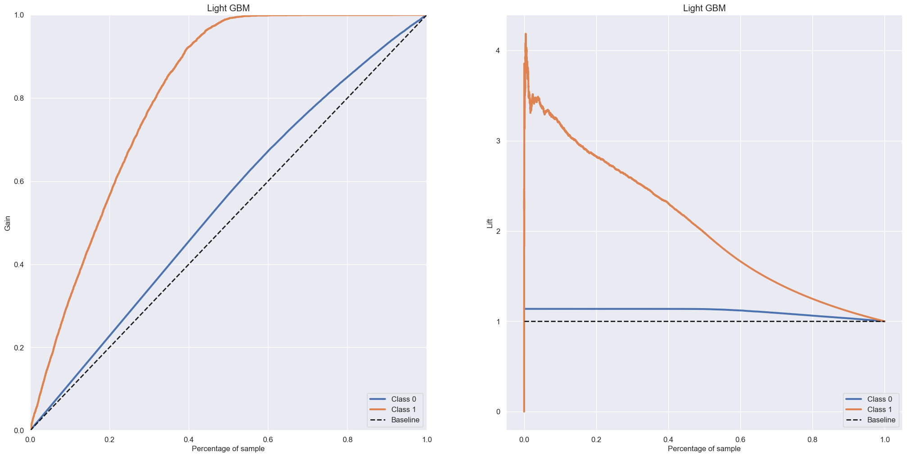

# Health Insurance Cross Sell

   
O objetivo deste projeto é ranquear uma lista de clientes de uma empresa de seguros, utilizando algoritmos de Machine Learning para decidir quais clientes tem uma propensão maior a compra de um seguro de automóvel.

## 1. Os Dados

O conjunto de dados está disponível na plataforma do Kaggle, através desse link: https://www.kaggle.com/anmolkumar/health-insurance-cross-sell-prediction

Os campos podem ser descritos como:

- **Id**: identificador único do cliente.
- **Gender**: gênero do cliente.
- **Age**: idade do cliente.
- **Driving License**: 0, o cliente não tem permissão para dirigir e 1, o cliente tem para dirigir ( CNH – Carteira Nacional de Habilitação )
- **Region Code**: código da região do cliente.
- **Previously Insured**: 0, o cliente não tem seguro de automóvel e 1, o cliente já tem seguro de automóvel.
- **Vehicle Age**: idade do veículo.
- **Vehicle Damage**: 0, cliente nunca teve seu veículo danificado no passado e 1, cliente já teve seu veículo danificado no passado.
- **Anual Premium**: quantidade que o cliente pagou à empresa pelo seguro de saúde anual.
- **Policy sales channel**: código anônimo para o canal de contato com o cliente.
- **Vintage**: número de dias que o cliente se associou à empresa através da compra do seguro de saúde.
- **Response**: 0, o cliente não tem interesse e 1, o cliente tem interesse.

# 2. Planejamento da Solução
**1. Entendimento do negócio** - Buscar entender quais são os problemas a serem solucionados e como solucioná-los, entender os motivos por trás da necessidade de ranqueamento dos clientes, quais aspectos serão considerados na hora da predição e quão melhor a solução proposta pode ser considerando os modelos de predição utilizados atualmente na empresa.

**2. Coleta de Dados** - Coletar os dados utilizando que estão hospedados em um database Postgres.

**3. Limpeza dos Dados** - Verificar possíveis dados faltantes e como tratá-los de acordo com a circunstância, analisar existências de outliers e como agir de acordo, verificar outras possíveis inconsistências nos dados.

**4. Exploração dos Dados** - Buscar o melhor entendimento do negócio através da geração de insights, confrontar e validar hipóteses de negócios, verificar possíveis correlações de atributos e como isso ajudará na etapa de ML.

**5. Preparação dos Dados** - Transformar e balancear os dados de acordo com suas características, para maximizar os resultados dos algoritmos de ML obtidos posteriormente.

**6. Seleção das Features** - Fazer a seleção das features visando selecionar as variáveis que mais impactam e explicam o fênomeno de interesse.

**7. Aplicação dos Modelos de Machine Learning** - Fazer o treinamento de Machine Learning e comparação dos resultados de diferentes algoritmos utilizando Cross-Validation.

**8. Hyperparameter Fine Tunning** - Utilização do método de Grid Search para seleção dos melhores parametros para o modelo de Machine Learning escolhido e  medição da Performance do modelo nos dados de Teste.

**9. Deploy do Modelo em Produção** - O modelo foi colocado em produção no ambiente cloud Heroku para que as predições possam ser acessados através de requisições a uma API.

## 3. Insights

**1.** Dentre os clientes com 40 anos ou mais 17,19% possuem um interesse no seguro, enquanto apenas 8,24% dos clientes com menos de 40 anos possuem interesse.

**2.** Dentre os clientes que não possuem seguro 22,57% possuem um interesse no seguro, enquanto apenas 0,09% dos clientes com seguro possuem interesse.

**3.**  Dentre os clientes que já tiveram o veículo danificado 23,80% possuem um interesse no seguro, enquanto apenas 0,52% dos clientes que não tiveram o veículo danificado possuem interesse.

**4.** Dentre os clientes que possuem licença 12,28% possuem um interesse no seguro, enquanto 4,78% dos clientes que não possuem licença possuem interesse.

**5.** Não existem variações significativas no interesse no seguro dos clientes em relação ao tempo de associação com a empresa.

## 4. Machine Learning

Aqui estão todos os modelos que foram testados, juntamente com um Cross-Validation das métricas que foram escolhidas para avaliar a performance.

| Model Name |	precision_at_20 |	recall_at_20 |	precision_at_40 |	recall_at_40 |	roc_auc_score |
| --- | ---| --- | --- | --- | --- |
| **Logistic Regression** |	0.3355 +/- 0.0018	| 0.547 +/- 0.0029 |	0.2799 +/- 0.0006 | 0.9126 +/- 0.0019 | 0.8435 +/- 0.0016 |
| **Gaussian Naive Bayes** | 0.3094 +/- 0.0027	| 0.5045 +/- 0.0045	| 0.2812 +/- 0.0008	| 0.917 +/- 0.0026 | 0.8332 +/- 0.0013 |
| **Extra Trees** |	0.3159 +/- 0.0028	| 0.515 +/- 0.0046 | 0.2722 +/- 0.0004 |	0.8877 +/- 0.0014 | 0.8287 +/- 0.0012 |
| **Random Forest** |	0.3455 +/- 0.003 |	0.5633 +/- 0.0048	| 0.2818 +/- 0.0009 |	0.9189 +/- 0.0028 | 0.8504 +/- 0.0016 |
| **Light GBM**	| 0.3549 +/- 0.0018	| 0.5786 +/- 0.0029	| 0.2839 +/- 0.0008 |	0.9257 +/- 0.0025 |	0.8562 +/- 0.0013 |
| **KNeighbors** | 0.2986 +/- 0.0014 |	0.4869 +/- 0.0022 | 0.2448 +/- 0.0008 |	0.7981 +/- 0.0025 | 0.7558 +/- 0.001 |

  O modelo escolhido foi o Light GBM e os resultados das métricas escolhidas e curvas de Ganho Acumulado e de Lift nos dados de teste, após o Hyperparameter Fine Tunning podem ser vistos a seguir:
  

| Model Name |	precision_at_20 |	recall_at_20 |	precision_at_40 |	recall_at_40 | roc_auc_score |
| --- | ---| --- | --- | --- | --- |
| **Light GBM Tunned**	| 0.343566	| 0.565415	| 0.427417	| 0.28042	| 0.922927 |	0.430145	| 0.852171 |

## 5. Conclusão
O objetivo do projeto foi alcançado, com a técnica de Learning to Rank utilizada foi possível ranquear os clientes mais propensos a adquirirem a compra do novo seguro. O modelo utilizado conseguiu selecionar 92,29% dos interessados da base de teste selecionando apenas 40% dos clientes, o que corresponde a uma performance 2,3 vezes maior que a utilização de uma base não ranqueada.

## 6. Próximos Passos

* Derivar Features para tentar melhorar a precisão dos modelos.

* Buscar novos modelos que melhorem a Performance.

* Testar novas Hipóteses para gerar mais insights através dos dados.
